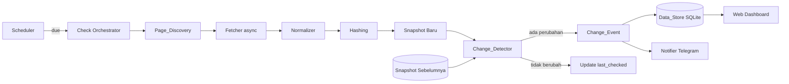
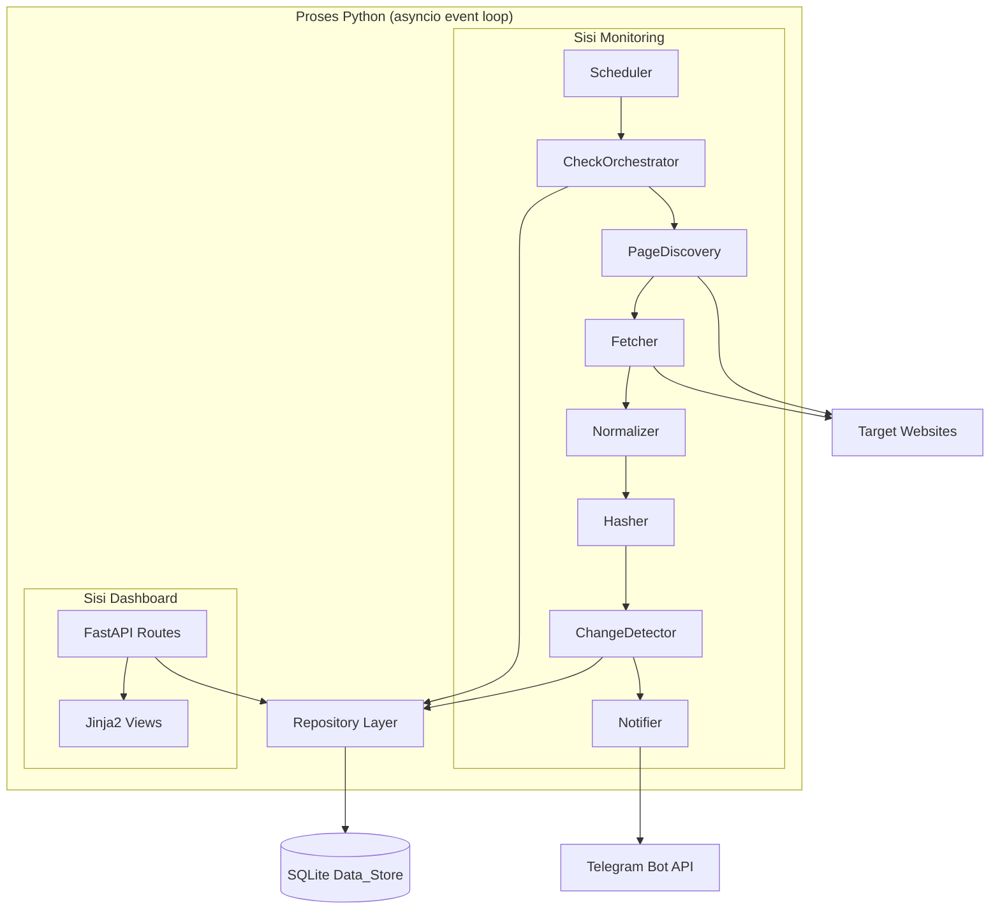

# Design Document

## Overview

Dokumen ini menjelaskan desain teknis untuk **Website Content Monitoring System** — sebuah aplikasi Python yang memantau hingga ~10 (maksimum 100) website company profile berbasis HTML statis, menemukan seluruh halamannya secara otomatis, mengambil konten secara asynchronous, menormalisasi menjadi teks bersih, menyimpan Snapshot, mendeteksi perubahan (teks, section, link, gambar), lalu mengirim notifikasi Telegram dan menampilkan riwayat melalui web Dashboard.

### Tujuan Desain

- **Ringan & mudah di-deploy di VPS**: proses Python tunggal, penyimpanan SQLite berbasis file, tanpa dependensi berat seperti headless browser.
- **Asynchronous & paralel**: memakai `asyncio` + `httpx.AsyncClient` untuk mengambil banyak halaman/gambar dari beberapa website secara bersamaan dengan batas konkurensi terkendali.
- **Deterministik**: normalisasi dan hashing menghasilkan keluaran yang stabil agar deteksi perubahan tidak menghasilkan false positive.
- **Hanya melaporkan perubahan nyata**: Change_Event hanya dibuat ketika Content_Hash atau Image_Hash berbeda dari baseline.

### Keputusan Teknologi

| Kebutuhan | Pilihan | Alasan |
|-----------|---------|--------|
| HTTP client async | `httpx.AsyncClient` | Mendukung `asyncio`, timeout, retry, connection pooling; cukup untuk HTML statis (Req 3.2) |
| Parsing HTML & normalisasi | `BeautifulSoup` + parser `lxml` | Toleran terhadap HTML malformed (Req 4.5), mudah menghapus script/style, mendekode entitas |
| Hashing | `hashlib.sha256` (stdlib) | Deterministik, collision-resistant; sama input → sama hash (Req 5.1, 7.2) |
| Diff teks | `difflib` (stdlib) | Diff berbasis baris untuk added/removed lines (Req 6.2) |
| Penyimpanan | SQLite via `aiosqlite` | Persisten lintas restart, tanpa server DB terpisah (Req 11.1) |
| Penjadwalan | Custom scheduler berbasis `asyncio` | Kontrol penuh atas per-website interval & hot-reload tanpa menghentikan check berjalan (Req 8.4) |
| Notifikasi | Telegram Bot HTTP API via `httpx` | Tidak butuh dependensi berat; mudah retry (Req 9) |
| Dashboard | `FastAPI` + `Jinja2` templates | Async, ringan, satu proses dengan backend monitoring (Req 10) |
| Property-based testing | `Hypothesis` | Standar de-facto PBT di Python |

### Alur Tingkat Tinggi



## Architecture

Sistem berjalan sebagai satu proses Python asyncio dengan dua "sisi" yang berbagi Data_Store yang sama:

1. **Sisi Monitoring (background)** — Scheduler memicu siklus pemeriksaan per website, menjalankan pipeline discovery → fetch → normalize → hash → detect → persist → notify.
2. **Sisi Dashboard (web)** — Aplikasi FastAPI yang membaca Data_Store untuk menampilkan daftar website, status, dan riwayat Change_Event.



### Lapisan (Layered Design)

- **Domain Layer** (murni, mudah diuji): `Normalizer`, `Hasher`, `ChangeDetector`, model data, validasi konfigurasi. Tidak melakukan I/O — inilah target utama property-based testing.
- **Infrastructure Layer** (I/O): `Fetcher` (HTTP), `Repository` (SQLite), `TelegramClient`, `Scheduler`.
- **Application Layer** (orkestrasi): `CheckOrchestrator` yang merangkai pipeline untuk satu website.
- **Presentation Layer**: rute FastAPI + template Jinja2.

Pemisahan ini memastikan logika inti (normalisasi, hashing, diff) dapat diuji sebagai fungsi murni tanpa jaringan atau database.

### Model Konkurensi

- Satu `asyncio` event loop.
- `Fetcher` memakai `asyncio.Semaphore` global (bawaan 10, rentang 1–100) untuk membatasi permintaan bersamaan lintas seluruh website (Req 3.1).
- Setiap pemeriksaan website dijalankan sebagai `asyncio.Task`. Scheduler tidak menunggu task selesai sebelum menjadwalkan siklus berikutnya, sehingga perubahan interval/konfigurasi diterapkan pada siklus berikutnya tanpa menginterupsi task yang sedang berjalan (Req 1.2, 1.3, 8.4).
- Penulisan ke SQLite diserialkan melalui satu koneksi writer + `asyncio.Lock` untuk menghindari kontensi (SQLite WAL mode).

## Components and Interfaces

### 1. Config & Validation (`config.py`)

Bertanggung jawab memvalidasi domain dan Polling_Interval sebelum disimpan.

```python
DOMAIN_MAX_LEN = 253
POLL_MIN_SECONDS = 10        # Req 1.6
POLL_MAX_SECONDS = 86400     # Req 1.6
POLL_MIN_MINUTES = 1         # Req 8.5
POLL_MAX_MINUTES = 1440      # Req 8.5
DEFAULT_GLOBAL_INTERVAL_SECONDS = 21600 # 6 jam (Req 8.3)
MAX_WEBSITES = 100           # Req 1.5, 1.8

def validate_domain(domain: str) -> ValidationResult:
    """Validasi format domain: 1–253 char, label dipisah titik,
    hanya huruf/angka/tanda hubung (Req 1.4)."""

def validate_poll_interval_seconds(value) -> ValidationResult:
    """Rentang 10..86400 detik; tolak non-integer (Req 1.6, 1.9)."""

def validate_poll_interval_minutes(value) -> ValidationResult:
    """Rentang 1..1440 menit; tolak non-integer/invalid (Req 8.5, 8.6)."""
```

`ValidationResult` mengembalikan `(ok: bool, error_message: str | None)`.

### 2. Page_Discovery (`discovery.py`)

```python
async def discover_pages(website: WebsiteConfig, fetcher: Fetcher) -> DiscoveryResult:
    """
    1. Coba ambil sitemap (timeout 30s). Jika valid, kumpulkan URL (Req 2.1).
    2. Jika gagal/invalid, crawl link internal dari homepage,
       depth <= 5, host sama persis (Req 2.2, 2.3).
    3. Dedup URL (Req 2.4). Batasi <= 5000 URL (Req 2.6).
    4. Jika homepage tak dapat diakses saat crawl, hasilkan kegagalan
       tanpa mengubah daftar URL tersimpan (Req 2.7).
    """
```

`DiscoveryResult` = `{ urls: list[str], failed: bool, failure_reason: str | None }`.

Fungsi pendukung murni (target PBT):
- `normalize_url(url) -> str` — kanonikalisasi (skema, host lowercase, hapus fragment, normalisasi trailing slash) untuk dedup andal.
- `is_same_host(candidate, base_host) -> bool` — same-host exact match, tolak subdomain berbeda & domain eksternal (Req 2.3).
- `dedup_urls(urls) -> list[str]` — hilangkan duplikat, pertahankan urutan kemunculan pertama (Req 2.4).
- `parse_sitemap(xml_bytes) -> list[str] | None` — kembalikan `None` jika format tidak valid.

### 3. Fetcher (`fetcher.py`)

```python
class Fetcher:
    def __init__(self, semaphore: asyncio.Semaphore,
                 timeout_seconds: int = 30):   # Req 3.5 (rentang 1..300)
        ...

    async def fetch_page(self, url: str) -> FetchResult:
        """HTTP GET tanpa headless browser (Req 3.2). Tandai gagal bila
        error/timeout atau status di luar 2xx (Req 3.3, 3.4)."""

    async def fetch_image(self, url: str) -> ImageFetchResult:
        """Unduh gambar: timeout 30s, maks 10MB, hingga 3 percobaan
        (Req 7.1, 7.5)."""
```

`FetchResult` = `{ url, ok: bool, status_code, html: str | None, failure_reason }`.
`ImageFetchResult` = `{ url, ok: bool, content: bytes | None, failure_reason }`.

Kegagalan satu halaman/gambar tidak menghentikan siklus; Snapshot sebelumnya dipertahankan (Req 3.3, 5.5, 7.5).

### 4. Normalizer (`normalizer.py`) — fungsi murni

```python
def normalize_html(html: str) -> NormalizeResult:
    """
    - Hapus elemen <script> & <style> beserta isinya (Req 4.1).
    - Hapus semua tag, dekode entitas HTML (Req 4.2).
    - Kolaps whitespace berturut menjadi satu spasi, trim (Req 4.3).
    - Deterministik: input identik -> output identik (Req 4.4).
    - HTML malformed -> ekstrak teks + tandai parse tidak sempurna (Req 4.5).
    - Input kosong -> output "" tanpa error (Req 4.6).
    """
```

`NormalizeResult` = `{ text: str, parse_incomplete: bool }`.

Juga menyediakan ekstraksi tambahan yang deterministik:
- `extract_links(html, base_url) -> list[str]` — URL absolut dari `<a href>`.
- `extract_image_urls(html, base_url) -> list[str]` — URL dari ``.
- `split_sections(text_or_dom) -> list[Section]` — blok teks di bawah tiap heading (`h1..h6`) untuk deteksi section (Req 6.4).

### 5. Hasher (`hashing.py`) — fungsi murni

```python
def content_hash(normalized_text: str) -> str:
    """sha256 hex dari teks ternormalisasi (Req 5.1)."""

def image_hash(content: bytes) -> str:
    """sha256 hex dari isi biner gambar (Req 7.2)."""
```

### 6. Change_Detector (`detector.py`) — fungsi murni

```python
def detect_changes(previous: Snapshot | None,
                   current: Snapshot) -> DetectionResult:
    """
    - Tanpa previous -> baseline, tidak ada Change_Event (Req 6.7).
    - content_hash sama & semua image_hash sama -> tidak berubah (Req 6.6, 12.1).
    - content_hash beda -> Diff baris teks added/removed (Req 6.2).
    - Diff section added/removed (Req 6.4).
    - Diff link added/removed by URL (Req 6.3).
    - Gambar added/removed by URL; same URL beda hash -> changed (Req 7.3, 7.4).
    - Jika ada perubahan apa pun -> buat tepat satu Change_Event (Req 6.5, 12.2).
    """
```

`DetectionResult` = `{ changed: bool, diff: Diff | None, change_event: ChangeEvent | None }`.

`Diff` berisi: `text_added: list[str]`, `text_removed: list[str]`, `links_added: list[str]`, `links_removed: list[str]`, `sections_added: list[str]`, `sections_removed: list[str]`, `images_added: list[str]`, `images_removed: list[str]`, `images_changed: list[str]`.

### 7. Scheduler (`scheduler.py`)

```python
class Scheduler:
    async def run(self):
        """Loop asyncio: untuk tiap website hitung waktu jatuh tempo
        berdasarkan poll_interval efektif (khusus atau global), toleransi
        <= 5s (Req 8.1). Baca ulang konfigurasi tiap iterasi sehingga
        perubahan interval/penambahan/penghapusan berlaku pada siklus
        berikutnya tanpa menghentikan task berjalan (Req 1.2, 1.3, 8.4)."""

    def effective_interval(self, website) -> int:
        """poll_interval_seconds khusus bila ada, selain itu global
        (Req 8.2, 8.3)."""
```

### 8. Notifier (`notifier.py`)

```python
class Notifier:
    async def notify(self, event: ChangeEvent, website: WebsiteConfig) -> bool:
        """Kirim pesan Telegram <=60s sejak event (Req 9.1). Sertakan URL
        halaman, nama website, waktu deteksi, ringkasan jumlah (Req 9.2).
        Retry <=3 kali, jeda >=5s (Req 9.3). Jika semua gagal, catat &
        pertahankan Change_Event (Req 9.4)."""

def build_summary(diff: Diff) -> ChangeSummary:
    """Hitung jumlah teks added/removed, link added/removed, image changed
    (Req 9.2). Fungsi murni."""
```

### 9. Repository (`repository.py`)

```python
class Repository:
    async def add_website(self, cfg: WebsiteConfig) -> None      # Req 1.1
    async def remove_website(self, website_id: str) -> None      # Req 1.2
    async def update_website(self, cfg: WebsiteConfig) -> None   # Req 1.3
    async def list_websites(self) -> list[WebsiteConfig]
    async def count_websites(self) -> int                        # Req 1.8
    async def get_latest_snapshot(self, url: str) -> Snapshot | None
    async def save_snapshot(self, snap: Snapshot) -> None        # Req 5.2, 5.4
    async def save_change_event(self, evt: ChangeEvent) -> None  # Req 11.2
    async def list_change_events(self, website_id: str) -> list[ChangeEvent]  # Req 10.4 (desc)
    async def update_last_check(self, website_id, ts, status) -> None
```

Repository men-serialize penulisan dan menangani kegagalan simpan dengan mempertahankan data lama + mengembalikan indikator kegagalan (Req 5.5, 11.5).

### 10. Dashboard (`web/`)

Rute FastAPI + template Jinja2:
- `GET /` — daftar website + status + last_checked, render <=3s (Req 10.1–10.3, 10.6).
- `GET /websites/{id}` — riwayat Change_Event terbaru→terlama (Req 10.4, 10.7).
- `GET /events/{event_id}` — tampilan Diff (Req 10.5).
- `POST /websites` / `DELETE /websites/{id}` — manajemen konfigurasi (Req 1.1, 1.2).
- Kegagalan pemuatan data → tampilkan pesan error tanpa mengubah data (Req 10.8).

## Data Models

### Model Domain (Python `dataclass`)

```python
@dataclass(frozen=True)
class WebsiteConfig:
    id: str                       # UUID
    domain: str                   # tervalidasi (Req 1.4)
    name: str                     # nama tampilan Monitored_Website
    poll_interval_seconds: int | None   # None -> pakai global (Req 8.2)
    created_at: datetime

@dataclass(frozen=True)
class Snapshot:
    url: str
    website_id: str
    normalized_text: str
    content_hash: str
    links: list[str]              # [] bila tidak ada (Req 5.2)
    image_hashes: dict[str, str]  # url -> image_hash; {} bila tidak ada
    checked_at: datetime          # Req 5.3

@dataclass(frozen=True)
class Diff:
    text_added: list[str]
    text_removed: list[str]
    links_added: list[str]
    links_removed: list[str]
    sections_added: list[str]
    sections_removed: list[str]
    images_added: list[str]
    images_removed: list[str]
    images_changed: list[str]     # same URL, beda Image_Hash (Req 7.4)

@dataclass(frozen=True)
class ChangeEvent:
    id: str
    website_id: str
    url: str
    detected_at: datetime         # Req 6.5
    diff: Diff
    summary: ChangeSummary

@dataclass(frozen=True)
class ChangeSummary:
    text_added: int
    text_removed: int
    links_added: int
    links_removed: int
    images_changed: int           # Req 9.2
```

### Skema SQLite (Data_Store)

```sql
CREATE TABLE website_config (
    id TEXT PRIMARY KEY,
    domain TEXT NOT NULL UNIQUE,        -- cegah duplikat (Req 1.7)
    name TEXT NOT NULL,
    poll_interval_seconds INTEGER,      -- NULL -> global
    created_at TEXT NOT NULL,
    last_checked_at TEXT,               -- NULL -> belum pernah (Req 10.2)
    last_status TEXT                    -- 'success' | 'failure' (Req 10.3)
);

CREATE TABLE snapshot (
    url TEXT NOT NULL,
    website_id TEXT NOT NULL REFERENCES website_config(id),
    normalized_text TEXT NOT NULL,
    content_hash TEXT NOT NULL,
    links_json TEXT NOT NULL,           -- JSON array
    image_hashes_json TEXT NOT NULL,    -- JSON object url->hash
    checked_at TEXT NOT NULL,
    PRIMARY KEY (url, checked_at)
);
CREATE INDEX idx_snapshot_latest ON snapshot(url, checked_at DESC);

CREATE TABLE change_event (
    id TEXT PRIMARY KEY,
    website_id TEXT NOT NULL REFERENCES website_config(id),
    url TEXT NOT NULL,
    detected_at TEXT NOT NULL,
    diff_json TEXT NOT NULL,            -- serialisasi Diff
    summary_json TEXT NOT NULL
);
CREATE INDEX idx_event_website ON change_event(website_id, detected_at DESC);

CREATE TABLE app_config (
    key TEXT PRIMARY KEY,               -- mis. 'global_poll_interval_seconds'
    value TEXT NOT NULL
);
```

Snapshot lama tidak dihapus sampai Snapshot baru berhasil disimpan (Req 5.4); Change_Event historis tidak pernah diubah/dihapus saat snapshot baru masuk (Req 11.4). Persistensi lintas restart dijamin oleh SQLite berbasis file (Req 11.1, 11.3).

### Serialisasi

`Snapshot`, `Diff`, dan `ChangeEvent` diserialkan ke JSON untuk disimpan. Karena serialisasi/deserialisasi adalah titik rawan bug, round-trip-nya diuji sebagai property (lihat Correctness Properties).

## Correctness Properties

*A property is a characteristic or behavior that should hold true across all valid executions of a system — essentially, a formal statement about what the system should do. Properties serve as the bridge between human-readable specifications and machine-verifiable correctness guarantees.*

Properti berikut diturunkan dari analisis prework atas acceptance criteria dan menjadi dasar property-based testing (min. 100 iterasi per properti). Kriteria yang bersifat contoh/edge-case/integrasi/smoke tidak dijadikan property dan diuji dengan pendekatan lain (lihat Testing Strategy).

### Property 1: Validasi format domain

*For any* string, `validate_domain` menerima string tersebut jika dan hanya jika panjangnya 1–253 karakter, tersusun atas label tak-kosong yang dipisahkan titik, dan setiap label hanya berisi huruf, angka, atau tanda hubung; selain itu ditolak dengan pesan yang menjelaskan format yang diharapkan.

**Validates: Requirements 1.4**

### Property 2: Pemilihan Polling_Interval efektif

*For any* Monitored_Website dan nilai global, `effective_interval` mengembalikan `poll_interval_seconds` khusus website bila ada (dan valid dalam 10..86400), dan mengembalikan nilai global bila tidak ada interval khusus.

**Validates: Requirements 1.6, 8.2, 8.3**

### Property 3: Validasi rentang Polling_Interval

*For any* nilai yang diberikan sebagai Polling_Interval, validasi menerima nilai tersebut jika dan hanya jika ia berupa bilangan bulat dalam rentang yang diperbolehkan (10..86400 detik untuk interval khusus per-website; 1..1440 menit untuk interval global), dan menolak nilai non-integer atau di luar rentang sambil mempertahankan nilai sebelumnya.

**Validates: Requirements 1.9, 8.5, 8.6**

### Property 4: Penemuan halaman terbatas pada host yang sama

*For any* base host dan sekumpulan URL kandidat, hasil `discover_pages`/`is_same_host` hanya berisi URL yang host-nya sama persis dengan domain Monitored_Website, tanpa URL subdomain berbeda maupun domain eksternal.

**Validates: Requirements 2.3**

### Property 5: Deduplikasi URL

*For any* daftar URL (termasuk yang mengandung duplikat), `dedup_urls` menghasilkan daftar tanpa duplikat yang mempertahankan urutan kemunculan pertama, dan operasi dedup bersifat idempoten (menerapkannya dua kali sama dengan sekali).

**Validates: Requirements 2.4**

### Property 6: Batas kedalaman crawl

*For any* graf link internal, crawling dari homepage tidak pernah menyertakan URL yang berada pada kedalaman lebih dari 5 tingkat dari homepage.

**Validates: Requirements 2.2**

### Property 7: Batas jumlah URL per website

*For any* sumber URL berapa pun banyaknya, jumlah URL yang dikumpulkan `discover_pages` untuk satu Monitored_Website tidak pernah melebihi 5.000.

**Validates: Requirements 2.6**

### Property 8: Pemetaan status HTTP ke keberhasilan fetch

*For any* kode status HTTP, `fetch_page` menandai hasil sebagai berhasil jika dan hanya jika kode berada dalam rentang keberhasilan (2xx); untuk kode lain hasil ditandai gagal dan kode status dicatat.

**Validates: Requirements 3.4**

### Property 9: Script dan style tidak muncul pada teks ternormalisasi

*For any* HTML, teks yang berada di dalam elemen `<script>` atau `<style>` tidak muncul pada keluaran `normalize_html`.

**Validates: Requirements 4.1**

### Property 10: Keluaran normalisasi bebas markup

*For any* HTML, keluaran `normalize_html` tidak mengandung tag HTML dan seluruh entitas HTML telah didekode menjadi karakter setara.

**Validates: Requirements 4.2**

### Property 11: Normalisasi whitespace

*For any* HTML, keluaran `normalize_html` tidak mengandung rangkaian whitespace berturut-turut lebih dari satu spasi dan tidak memiliki whitespace di awal maupun akhir.

**Validates: Requirements 4.3**

### Property 12: Determinisme normalisasi

*For any* HTML, memanggil `normalize_html` dua kali atas masukan yang identik menghasilkan keluaran teks yang identik secara karakter demi karakter.

**Validates: Requirements 4.4**

### Property 13: Determinisme dan sensitivitas Content_Hash

*For any* teks ternormalisasi, `content_hash` menghasilkan nilai yang sama untuk masukan yang sama, dan menghasilkan nilai berbeda untuk dua teks yang berbeda.

**Validates: Requirements 5.1**

### Property 14: Round-trip serialisasi Snapshot

*For any* Snapshot valid, menyerialkan lalu mendeserialkannya menghasilkan Snapshot yang setara, termasuk mempertahankan daftar link dan daftar Image_Hash kosong sebagai kosong.

**Validates: Requirements 5.2**

### Property 15: Diff teks added/removed benar

*For any* dua Snapshot dengan teks berbeda, Diff yang dihasilkan memuat baris `text_added` yang ada pada teks baru namun tidak pada teks lama, dan baris `text_removed` yang ada pada teks lama namun tidak pada teks baru.

**Validates: Requirements 6.2**

### Property 16: Deteksi perubahan link berbasis himpunan URL

*For any* dua Snapshot, `links_added` sama dengan himpunan URL link yang ada pada Snapshot baru tetapi tidak pada yang lama, dan `links_removed` sama dengan yang ada pada Snapshot lama tetapi tidak pada yang baru.

**Validates: Requirements 6.3**

### Property 17: Deteksi perubahan section berbasis heading

*For any* dua Snapshot, `sections_added` dan `sections_removed` masing-masing dihitung dengan benar sebagai selisih himpunan section (blok teks di bawah heading) antara Snapshot baru dan lama.

**Validates: Requirements 6.4**

### Property 18: Kondisi tidak-berubah tidak menghasilkan Change_Event

*For any* Snapshot, apabila tidak ada Snapshot sebelumnya, atau Content_Hash sama dengan sebelumnya dan seluruh Image_Hash tidak berubah, maka `detect_changes` menghasilkan `changed = False`, tidak membuat Change_Event, dan tidak memicu notifikasi.

**Validates: Requirements 6.1, 6.6, 6.7, 9.5, 12.1**

### Property 19: Perubahan menghasilkan tepat satu Change_Event

*For any* pasangan Snapshot yang mengandung perbedaan apa pun (teks, section, link, atau gambar), `detect_changes` membuat tepat satu Change_Event untuk halaman tersebut yang mencatat URL halaman, waktu deteksi, dan Diff.

**Validates: Requirements 6.5, 12.2**

### Property 20: Determinisme dan sensitivitas Image_Hash

*For any* isi biner gambar, `image_hash` menghasilkan nilai yang sama untuk isi yang sama dan nilai berbeda untuk isi yang berbeda.

**Validates: Requirements 7.2**

### Property 21: Deteksi gambar added/removed berbasis URL

*For any* dua Snapshot, `images_added` sama dengan URL gambar yang hanya ada pada Snapshot baru dan `images_removed` sama dengan URL gambar yang hanya ada pada Snapshot lama.

**Validates: Requirements 7.3**

### Property 22: Deteksi gambar dengan URL sama tetapi isi berbeda

*For any* URL gambar yang muncul pada kedua Snapshot, gambar tersebut masuk ke `images_changed` jika dan hanya jika Image_Hash-nya berbeda antara kedua Snapshot.

**Validates: Requirements 7.4**

### Property 23: Ringkasan perubahan pada notifikasi

*For any* Diff, `build_summary` menghasilkan jumlah yang sama dengan panjang daftar terkait (teks ditambah/dihapus, link ditambah/dihapus, gambar berubah), dan pesan notifikasi memuat URL halaman, nama Monitored_Website, waktu deteksi, serta seluruh angka ringkasan tersebut.

**Validates: Requirements 9.2**

### Property 24: Pengurutan riwayat Change_Event

*For any* himpunan Change_Event milik sebuah Monitored_Website, daftar yang dikembalikan untuk Dashboard terurut menurun berdasarkan `detected_at` (terbaru ke terlama).

**Validates: Requirements 10.4**

### Property 25: Change_Event historis dipertahankan saat snapshot baru disimpan

*For any* himpunan Change_Event yang sudah tersimpan, menyimpan Snapshot baru tidak menghapus maupun mengubah Change_Event historis yang ada.

**Validates: Requirements 11.4**

## Error Handling

Prinsip umum: kegagalan pada satu halaman/gambar/website tidak boleh menghentikan siklus; data lama dipertahankan; kegagalan dicatat dan dipermukaan ke Dashboard.

| Sumber kegagalan | Penanganan | Requirements |
|------------------|-----------|--------------|
| Sitemap gagal/tidak valid | Fallback ke crawl link internal | 2.1, 2.2 |
| Homepage tak dapat diakses saat crawl | Hentikan discovery website itu, `failed=True`, daftar URL tersimpan tak diubah | 2.7 |
| HTTP request halaman gagal/timeout | Tandai halaman gagal + alasan, pertahankan Snapshot lama, lanjut halaman lain | 3.3, 3.4 |
| Unduhan gambar gagal setelah 3 percobaan | Tandai URL gambar gagal, lanjut gambar lain | 7.5 |
| Perhitungan Image_Hash gagal | Tandai gambar gagal diproses, lanjut | 7.6 |
| HTML malformed | Ekstrak teks yang bisa didapat, `parse_incomplete=True`, tidak berhenti | 4.5 |
| Konten kosong | Hasilkan teks kosong tanpa error | 4.6 |
| Simpan Snapshot gagal | Pertahankan Snapshot sebelumnya, kembalikan indikator gagal | 5.5 |
| Simpan ke Data_Store gagal | Pertahankan data lama, kembalikan indikator gagal | 11.5 |
| Pembuatan Change_Event gagal | Pertahankan baseline, JANGAN update last_checked, tampilkan indikasi error | 12.4 |
| Muat data / data rusak saat restart | Lanjut operasi tanpa berhenti, kembalikan indikator error muat | 11.6 |
| Semua percobaan notifikasi gagal | Catat notifikasi tidak terkirim, pertahankan Change_Event, siklus lanjut | 9.4 |
| Pemuatan data Dashboard gagal | Tampilkan indikasi error tanpa mengubah data tersimpan | 10.8 |

Strategi konkurensi: setiap unit kerja (fetch halaman, fetch gambar, simpan) dibungkus penanganan pengecualian sehingga kegagalan terisolasi. Task pemeriksaan per-website dijalankan dengan `asyncio.gather(..., return_exceptions=True)` agar satu kegagalan tidak membatalkan yang lain.

## Testing Strategy

Pendekatan pengujian bersifat ganda: **property-based tests** untuk logika inti yang deterministik dan **unit/integration/smoke tests** untuk perilaku spesifik, I/O, dan infrastruktur.

### Property-Based Tests (Hypothesis)

- Library: **Hypothesis** (tidak mengimplementasikan PBT dari nol).
- Konfigurasi: **minimal 100 iterasi** per properti (`@settings(max_examples=100)` atau lebih).
- Setiap test properti diberi tag komentar merujuk properti desain, format:
  `# Feature: website-monitoring, Property {number}: {property_text}`
- Target: Property 1–25 di atas, mencakup normalizer, hashing, diff/detector, dedup URL, validasi konfigurasi, pemilihan interval, batas discovery, serialisasi round-trip, ringkasan notifikasi, pengurutan riwayat, dan preservasi event historis.
- Generator kustom:
  - Generator HTML (termasuk kasus malformed, kosong, entitas, whitespace berlebih, script/style bersarang) untuk Property 9–12 sekaligus menutup edge-case Req 4.5 & 4.6.
  - Generator domain valid & invalid untuk Property 1.
  - Generator nilai interval (integer dalam/luar rentang + non-integer) untuk Property 3.
  - Generator daftar/graf URL untuk Property 4–7.
  - Generator Snapshot (teks, link, image_hashes) untuk Property 14–22, 25.

### Unit Tests (contoh spesifik & error handling)

Untuk kriteria yang diklasifikasikan EXAMPLE/EDGE_CASE pada prework, mis.:
- Manajemen konfigurasi: tambah/hapus/ubah, tolak duplikat, batas kapasitas (Req 1.1, 1.2, 1.3, 1.5, 1.7, 1.8).
- Fallback & kegagalan discovery (Req 2.1, 2.5, 2.7).
- Penanganan kegagalan fetch & gambar (Req 3.3, 3.5, 7.1, 7.5, 7.6).
- Persistensi & kegagalan simpan/muat (Req 5.3, 5.4, 5.5, 11.2, 11.3, 11.5, 11.6).
- Perilaku Dashboard: last_checked, indikator status, empty state, kegagalan muat (Req 10.2, 10.3, 10.5, 10.6, 10.7, 10.8).
- Notifikasi: retry & jeda, kegagalan total (Req 9.3, 9.4).
- Pelaporan hanya saat berubah pada tingkat orkestrasi (Req 12.3, 12.4).

### Integration Tests (1–3 contoh, dengan mock jika perlu)

- Konkurensi Fetcher: permintaan bersamaan tidak melebihi batas semaphore (Req 3.1).
- Pengiriman notifikasi Telegram terpicu dalam batas waktu, memakai mock Telegram API (Req 9.1).
- Penjadwalan: trigger sesuai interval dengan toleransi, hot-reload interval tanpa menghentikan task berjalan, memakai clock tiruan (Req 8.1, 8.4).

### Smoke Tests (eksekusi tunggal)

- HTTP client dipakai tanpa headless browser (Req 3.2).
- SQLite persisten: tulis lalu buka ulang koneksi, data tetap ada (Req 11.1).
- Dashboard memuat daftar (Req 10.1).

### Cakupan

Kombinasi ini memastikan: property tests memverifikasi kebenaran umum logika inti di seluruh ruang input, sedangkan unit/integration/smoke tests memverifikasi perilaku konkret, penanganan error, I/O, dan wiring infrastruktur yang tidak cocok untuk PBT.
