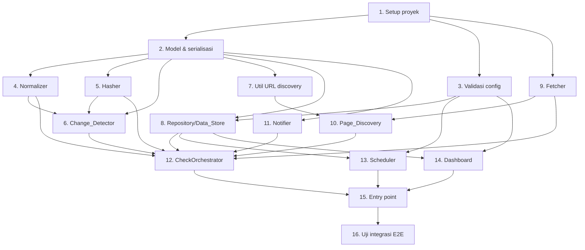

# Implementation Plan

## Overview

Rencana implementasi untuk Website Content Monitoring System. Task disusun mengikuti desain berlapis: lapisan domain murni (model, validasi, normalizer, hasher, detector, util URL) dibangun & diuji lebih dulu, lalu infrastruktur (repository, fetcher, discovery, notifier, scheduler), kemudian orkestrasi aplikasi, presentasi (dashboard), dan terakhir wiring entry point serta uji end-to-end. Property-based test (Hypothesis, min 100 iterasi) menyertai logika inti sesuai 25 Correctness Property pada design. Task deployment sengaja tidak disertakan sesuai keputusan pengguna.

## Task Dependency Graph



```json
{
  "waves": [
    { "wave": 1, "tasks": ["1"] },
    { "wave": 2, "tasks": ["2", "3", "9"] },
    { "wave": 3, "tasks": ["4", "5", "7", "8", "11"] },
    { "wave": 4, "tasks": ["6", "10", "13", "14"] },
    { "wave": 5, "tasks": ["12"] },
    { "wave": 6, "tasks": ["15"] },
    { "wave": 7, "tasks": ["16"] }
  ]
}
```

## Tasks

- [x] 1. Siapkan struktur proyek dan dependensi
  - Buat struktur package Python (`src/monitoring/` dengan sub-package `domain/`, `infra/`, `app/`, `web/`) dan direktori `tests/`.
  - Buat `pyproject.toml`/`requirements.txt` dengan dependensi: `httpx`, `beautifulsoup4`, `lxml`, `aiosqlite`, `fastapi`, `jinja2`, `uvicorn`, dan dev-deps `pytest`, `pytest-asyncio`, `hypothesis`.
  - Tambahkan konfigurasi `pytest` dan modul konstanta (`config.py`) berisi nilai bawaan/rentang: `POLL_MIN_SECONDS=10`, `POLL_MAX_SECONDS=86400`, `POLL_MIN_MINUTES=1`, `POLL_MAX_MINUTES=1440`, `DEFAULT_GLOBAL_INTERVAL_SECONDS=1800`, `MAX_WEBSITES=100`, `DOMAIN_MAX_LEN=253`.
  - _Requirements: 1.5, 8.3_

- [x] 2. Implementasikan model domain dan serialisasi
- [x] 2.1 Definisikan dataclass domain
  - Implementasikan `WebsiteConfig`, `Snapshot`, `Diff`, `ChangeEvent`, `ChangeSummary` sebagai `dataclass(frozen=True)` sesuai bagian Data Models pada design.
  - Pastikan `Snapshot.links` default `[]` dan `Snapshot.image_hashes` default `{}` saat tidak ada.
  - _Requirements: 5.2_
- [x] 2.2 Implementasikan serialisasi JSON dan uji round-trip
  - Buat fungsi serialize/deserialize `Snapshot`, `Diff`, `ChangeEvent` ke/dari JSON.
  - Tulis property-based test round-trip (Hypothesis, min 100 iterasi) dengan generator Snapshot.
  - `# Feature: website-monitoring, Property 14: Round-trip serialisasi Snapshot`
  - _Requirements: 5.2_

- [x] 3. Implementasikan validasi konfigurasi (`config.py`)
- [x] 3.1 Validasi format domain
  - Implementasikan `validate_domain(domain) -> ValidationResult` (panjang 1–253, label dipisah titik, hanya huruf/angka/tanda hubung).
  - Tulis property-based test dengan generator domain valid & invalid.
  - `# Feature: website-monitoring, Property 1: Validasi format domain`
  - _Requirements: 1.4_
- [x] 3.2 Validasi rentang Polling_Interval
  - Implementasikan `validate_poll_interval_seconds` (10..86400) dan `validate_poll_interval_minutes` (1..1440), tolak non-integer/di luar rentang.
  - Tulis property-based test dengan generator nilai dalam/luar rentang + non-integer.
  - `# Feature: website-monitoring, Property 3: Validasi rentang Polling_Interval`
  - _Requirements: 1.9, 8.5, 8.6_

- [x] 4. Implementasikan Normalizer (`domain/normalizer.py`) — fungsi murni
- [x] 4.1 Implementasikan `normalize_html`
  - Hapus elemen `<script>`/`<style>` beserta isinya, hapus tag, dekode entitas, kolaps whitespace + trim; tangani HTML malformed (`parse_incomplete=True`) dan input kosong.
  - _Requirements: 4.1, 4.2, 4.3, 4.5, 4.6_
- [x] 4.2 Property-based tests Normalizer
  - Buat generator HTML (termasuk malformed, kosong, entitas, whitespace berlebih, script/style bersarang).
  - `# Feature: website-monitoring, Property 9: Script dan style tidak muncul pada teks ternormalisasi`
  - `# Feature: website-monitoring, Property 10: Keluaran normalisasi bebas markup`
  - `# Feature: website-monitoring, Property 11: Normalisasi whitespace`
  - `# Feature: website-monitoring, Property 12: Determinisme normalisasi`
  - _Requirements: 4.1, 4.2, 4.3, 4.4_
- [x] 4.3 Implementasikan ekstraksi link, gambar, dan section
  - Implementasikan `extract_links`, `extract_image_urls` (URL absolut dari base_url), dan `split_sections` (blok teks di bawah heading h1–h6).
  - Tulis unit test contoh untuk masing-masing.
  - _Requirements: 6.3, 6.4, 7.3_

- [x] 5. Implementasikan Hasher (`domain/hashing.py`) — fungsi murni
  - Implementasikan `content_hash(normalized_text)` dan `image_hash(content: bytes)` memakai `hashlib.sha256` (hex).
  - Tulis property-based test determinisme & sensitivitas untuk keduanya.
  - `# Feature: website-monitoring, Property 13: Determinisme dan sensitivitas Content_Hash`
  - `# Feature: website-monitoring, Property 20: Determinisme dan sensitivitas Image_Hash`
  - _Requirements: 5.1, 7.2_

- [x] 6. Implementasikan Change_Detector (`domain/detector.py`) — fungsi murni
- [x] 6.1 Implementasikan `detect_changes`
  - Tangani baseline (tanpa previous), kondisi tidak-berubah (content_hash sama & semua image_hash sama), diff teks (difflib), diff section, diff link by URL, diff gambar (added/removed by URL + changed by hash), dan pembuatan tepat satu Change_Event bila ada perubahan.
  - _Requirements: 6.1, 6.2, 6.3, 6.4, 6.5, 6.6, 6.7, 7.3, 7.4, 12.1, 12.2_
- [x] 6.2 Property-based tests Change_Detector
  - Buat generator pasangan Snapshot (teks, link, image_hashes).
  - `# Feature: website-monitoring, Property 15: Diff teks added/removed benar`
  - `# Feature: website-monitoring, Property 16: Deteksi perubahan link berbasis himpunan URL`
  - `# Feature: website-monitoring, Property 17: Deteksi perubahan section berbasis heading`
  - `# Feature: website-monitoring, Property 18: Kondisi tidak-berubah tidak menghasilkan Change_Event`
  - `# Feature: website-monitoring, Property 19: Perubahan menghasilkan tepat satu Change_Event`
  - `# Feature: website-monitoring, Property 21: Deteksi gambar added/removed berbasis URL`
  - `# Feature: website-monitoring, Property 22: Deteksi gambar dengan URL sama tetapi isi berbeda`
  - _Requirements: 6.2, 6.3, 6.4, 6.5, 6.6, 6.7, 7.3, 7.4, 12.1, 12.2_

- [x] 7. Implementasikan util Page_Discovery murni (`domain/urls.py`)
- [x] 7.1 Implementasikan fungsi util URL
  - Implementasikan `normalize_url`, `is_same_host`, `dedup_urls`, `parse_sitemap`.
  - _Requirements: 2.3, 2.4_
- [x] 7.2 Property-based tests util URL
  - `# Feature: website-monitoring, Property 4: Penemuan halaman terbatas pada host yang sama`
  - `# Feature: website-monitoring, Property 5: Deduplikasi URL`
  - _Requirements: 2.3, 2.4_

- [x] 8. Implementasikan Data_Store / Repository (`infra/repository.py`)
- [x] 8.1 Setup skema SQLite dan koneksi
  - Buat inisialisasi skema (`website_config`, `snapshot`, `change_event`, `app_config`) dengan index sesuai design; aktifkan WAL; serialisasi penulisan via satu writer + `asyncio.Lock`.
  - Tulis smoke test persistensi (tulis lalu buka ulang koneksi, data tetap ada).
  - _Requirements: 11.1_
- [x] 8.2 Implementasikan operasi CRUD website & konfigurasi
  - `add_website` (tolak duplikat via UNIQUE domain, tolak bila melebihi `MAX_WEBSITES`), `remove_website`, `update_website`, `list_websites`, `count_websites`.
  - Tulis unit test: tambah/hapus/ubah, tolak duplikat, tolak kapasitas.
  - _Requirements: 1.1, 1.2, 1.3, 1.5, 1.7, 1.8_
- [x] 8.3 Implementasikan operasi snapshot & change event
  - `get_latest_snapshot`, `save_snapshot` (pertahankan snapshot lama sampai yang baru tersimpan; kembalikan indikator gagal saat simpan gagal), `save_change_event`, `list_change_events` (urut `detected_at` DESC), `update_last_check`.
  - Tulis property-based test pengurutan riwayat dan preservasi event historis; unit test kegagalan simpan.
  - `# Feature: website-monitoring, Property 24: Pengurutan riwayat Change_Event`
  - `# Feature: website-monitoring, Property 25: Change_Event historis dipertahankan saat snapshot baru disimpan`
  - _Requirements: 5.2, 5.3, 5.4, 5.5, 10.4, 11.2, 11.4, 11.5_
- [x] 8.4 Implementasikan pemuatan data saat restart
  - Muat `Website_Config` dan snapshot terbaru per halaman; tangani data gagal-muat/rusak dengan melanjutkan operasi + indikator error.
  - Tulis unit test restart & data rusak.
  - _Requirements: 11.3, 11.6_

- [x] 9. Implementasikan Fetcher (`infra/fetcher.py`)
- [x] 9.1 Implementasikan fetch halaman async
  - `fetch_page` memakai `httpx.AsyncClient` (tanpa headless), semaphore global (bawaan 10, rentang 1–100), timeout dapat dikonfigurasi (bawaan 30s, rentang 1–300); tandai gagal untuk error/timeout/status di luar 2xx.
  - Tulis property-based test pemetaan status HTTP; unit test timeout & kegagalan.
  - `# Feature: website-monitoring, Property 8: Pemetaan status HTTP ke keberhasilan fetch`
  - _Requirements: 3.1, 3.2, 3.3, 3.4, 3.5_
- [x] 9.2 Implementasikan unduhan gambar
  - `fetch_image` dengan timeout 30s, batas 10MB, hingga 3 percobaan; tandai gagal per-URL tanpa menghentikan pemrosesan gambar lain.
  - Tulis unit test retry, batas ukuran, dan kegagalan.
  - _Requirements: 7.1, 7.5_
- [x] 9.3 Tambahkan uji batas konkurensi (integrasi)
  - Verifikasi permintaan bersamaan tidak melebihi batas semaphore.
  - _Requirements: 3.1_

- [x] 10. Implementasikan Page_Discovery lengkap (`infra/discovery.py`)
  - `discover_pages`: coba sitemap (timeout 30s) lalu fallback crawl link internal (depth ≤ 5, host sama), dedup, batasi ≤ 5000 URL, sertakan halaman produk/kategori, dan tangani homepage tak dapat diakses tanpa mengubah daftar tersimpan.
  - Tulis property-based test batas kedalaman & batas jumlah URL; unit test fallback sitemap dan kegagalan homepage.
  - `# Feature: website-monitoring, Property 6: Batas kedalaman crawl`
  - `# Feature: website-monitoring, Property 7: Batas jumlah URL per website`
  - _Requirements: 2.1, 2.2, 2.5, 2.6, 2.7_

- [x] 11. Implementasikan Notifier Telegram (`infra/notifier.py`)
- [x] 11.1 Implementasikan `build_summary` dan pesan notifikasi
  - `build_summary(diff)` (fungsi murni) menghitung jumlah teks/link/gambar; format pesan memuat URL halaman, nama website, waktu deteksi, dan angka ringkasan.
  - Tulis property-based test ringkasan.
  - `# Feature: website-monitoring, Property 23: Ringkasan perubahan pada notifikasi`
  - _Requirements: 9.2_
- [x] 11.2 Implementasikan pengiriman + retry
  - Kirim via Telegram Bot API (`httpx`), retry ≤ 3 kali dengan jeda ≥ 5s; bila semua gagal catat "tidak terkirim" dan pertahankan Change_Event.
  - Tulis unit test retry/jeda dan integrasi pengiriman ≤ 60s dengan mock API.
  - _Requirements: 9.1, 9.3, 9.4_

- [x] 12. Implementasikan CheckOrchestrator (`app/orchestrator.py`)
  - Rangkai pipeline satu website: discovery → fetch halaman/gambar → normalize → hash → bangun Snapshot → `detect_changes` → simpan snapshot + change event → picu notifikasi hanya bila berubah → update `last_checked`/status.
  - Isolasi kegagalan per halaman/gambar via `asyncio.gather(..., return_exceptions=True)`; saat pembuatan Change_Event gagal, pertahankan baseline & jangan update last_checked.
  - Tulis unit test: lapor hanya saat berubah, no-notif saat tidak berubah, kegagalan pembuatan event.
  - _Requirements: 3.3, 4.5, 5.5, 7.5, 7.6, 9.5, 12.1, 12.2, 12.3, 12.4_

- [x] 13. Implementasikan Scheduler (`infra/scheduler.py`)
  - Loop asyncio yang menghitung jatuh tempo per website berdasarkan interval efektif (khusus/global, default 30 menit), toleransi ≤ 5s; baca ulang konfigurasi tiap iterasi sehingga perubahan interval/tambah/hapus berlaku siklus berikutnya tanpa menghentikan task berjalan.
  - Implementasikan `effective_interval` dan uji sebagai property; integrasi penjadwalan dengan clock tiruan.
  - `# Feature: website-monitoring, Property 2: Pemilihan Polling_Interval efektif`
  - _Requirements: 1.2, 1.3, 1.6, 8.1, 8.2, 8.3, 8.4_

- [x] 14. Implementasikan Web Dashboard (`web/`)
- [x] 14.1 Rute daftar & status website
  - `GET /` menampilkan daftar website, last_checked (indikasi "belum pernah" bila null), indikator status berbeda untuk sukses/gagal, empty state bila tidak ada website; tangani kegagalan pemuatan.
  - _Requirements: 10.1, 10.2, 10.3, 10.6, 10.8_
- [x] 14.2 Rute riwayat & detail Diff
  - `GET /websites/{id}` menampilkan riwayat Change_Event (terbaru→terlama, empty state bila kosong); `GET /events/{id}` menampilkan Diff.
  - _Requirements: 10.4, 10.5, 10.7_
- [x] 14.3 Rute manajemen konfigurasi
  - `POST /websites` (validasi domain + konfirmasi tambah) dan `DELETE /websites/{id}`.
  - _Requirements: 1.1, 1.2_

- [x] 15. Rangkai entry point aplikasi (`main.py`)
  - Jalankan sisi monitoring (Scheduler) dan sisi dashboard (FastAPI/uvicorn) dalam satu event loop asyncio; inisialisasi Data_Store, muat konfigurasi, dan pastikan graceful shutdown.
  - Tulis smoke test: aplikasi start, dashboard memuat daftar.
  - _Requirements: 10.1, 11.1, 11.3_

- [x] 16. Uji integrasi menyeluruh (end-to-end dengan mock jaringan)
  - Simulasikan satu siklus penuh memakai fixture HTML: baseline (tanpa event), perubahan teks/link/section (buat event + notif), perubahan gambar URL-sama-isi-beda, dan halaman gagal fetch (tidak menghentikan siklus).
  - _Requirements: 6.5, 7.4, 12.2, 12.3_

## Notes

- Setiap task property-based test memakai Hypothesis dengan minimal 100 iterasi dan diberi komentar tag `# Feature: website-monitoring, Property {n}: {teks properti}` merujuk properti pada design.
- Lapisan domain (task 2–7) dibuat sebagai fungsi murni tanpa I/O agar mudah diuji lebih dulu sebelum infrastruktur.
- Kriteria bertipe contoh/edge-case/integrasi/smoke diuji lewat unit/integration/smoke test, bukan property test.
- Task deployment (Docker, systemd, autentikasi dashboard) sengaja tidak disertakan sesuai keputusan pengguna dan dapat ditambahkan sebagai pengembangan lanjutan.
